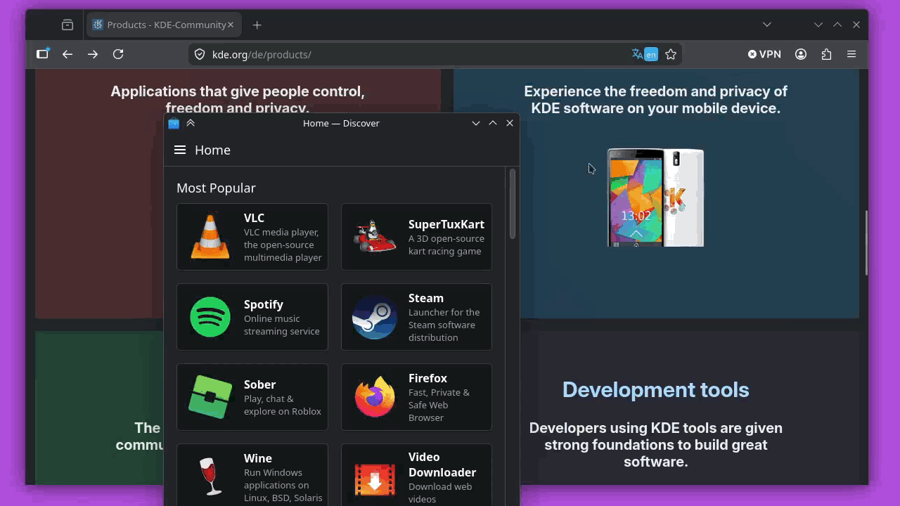
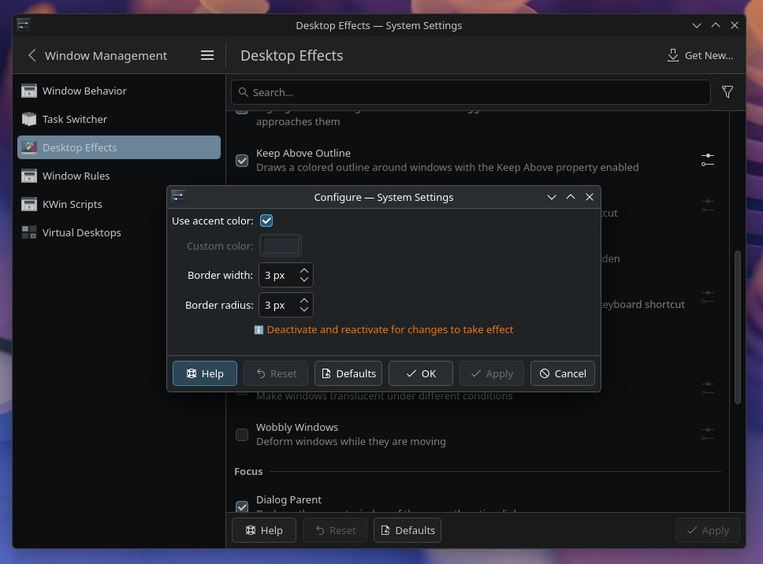

# Keep Above Outline

A KWin effect for KDE Plasma 6 that draws a colored outline around any window
that has the **Keep Above** property enabled, making it easy to spot pinned
windows at a glance.





## Features

- Outlines every window marked *Keep Above* with a configurable border.
- Uses the current Plasma accent color by default, or a custom color of your choice.
- Adjustable border width (1–20 px) and corner radius (0–30 px).
- Configurable through System Settings → Window Management → Desktop Effects.

## Requirements

- KDE Plasma 6 / KWin 6
- Qt 6 (Core, Gui, Widgets, Quick)
- KF6 (CoreAddons, ConfigWidgets, KCMUtils)
- Extra CMake Modules (ECM)
- Vulkan headers (required transitively by KWin 6.7+)
- A C++20 compiler
- CMake ≥ 3.20


**Arch / CachyOS / Manjaro**
```sh
sudo pacman -S extra-cmake-modules kwin kcmutils kconfigwidgets qt6-base vulkan-headers
```

**Debian / Ubuntu (KDE Neon, Kubuntu)**
```sh
sudo apt install extra-cmake-modules kwin-dev libkf6kcmutils-dev libkf6configwidgets-dev qt6-base-dev libvulkan-dev
```

**Fedora**
```sh
sudo dnf install extra-cmake-modules kwin-devel kf6-kcmutils-devel kf6-kconfigwidgets-devel qt6-qtbase-devel vulkan-headers
```

**openSUSE Tumbleweed**
```sh
sudo zypper install extra-cmake-modules kwin6-devel kf6-kcmutils-devel kf6-kconfigwidgets-devel qt6-base-devel vulkan-headers
```


## Building

```sh
cmake -B build -S . -DCMAKE_BUILD_TYPE=Release
cmake --build build
```

## Installing

```sh
sudo cmake --install build
```

## Enabling the effect

1. Open **System Settings → Window Management → Desktop Effects**.
2. Find **Keep Above Outline** under *Appearance*.
3. Tick the checkbox to enable it, and use the gear icon to configure the
   color, border width, and corner radius.

## Configuration

| Option           | Default   | Description                                                |
| ---------------- | --------- | ---------------------------------------------------------- |
| Use accent color | `true`    | Follow the current Plasma accent color.                    |
| Custom color     | `#3daee9` | Used when *Use accent color* is disabled.                  |
| Border width     | `3`       | Outline thickness in pixels (1–20).                        |
| Border radius    | `0`       | Corner radius in pixels (0–30).                            |

Settings are stored in `kwinrc` under the `[Effect-keep-above-outline]` group.

## Project layout

- `keepaboveoutline.{h,cpp}` — the KWin effect plugin.
- `keepaboveoutline_config.{h,cpp,ui}` — the System Settings configuration module.
- `keepaboveoutlineconfig.kcfg` — schema for the persisted settings.
- `metadata.json` — KPlugin metadata used by KWin to load the effect.
- `CMakeLists.txt` — build definitions for both plugins.

## License

GPL-3.0-or-later. See [LICENSE](LICENSE) for the full text and the SPDX headers in the source files.

## Disclaimer

Parts of this project were written with the assistance of AI.

## Author

Matthias Bauer
